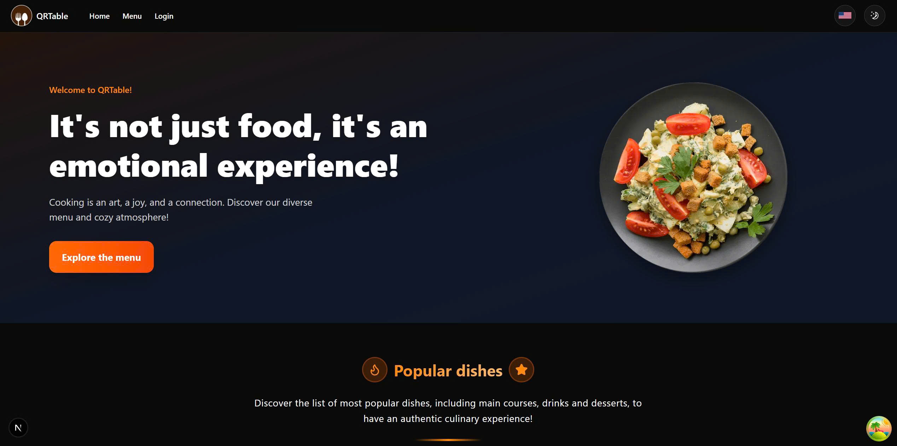
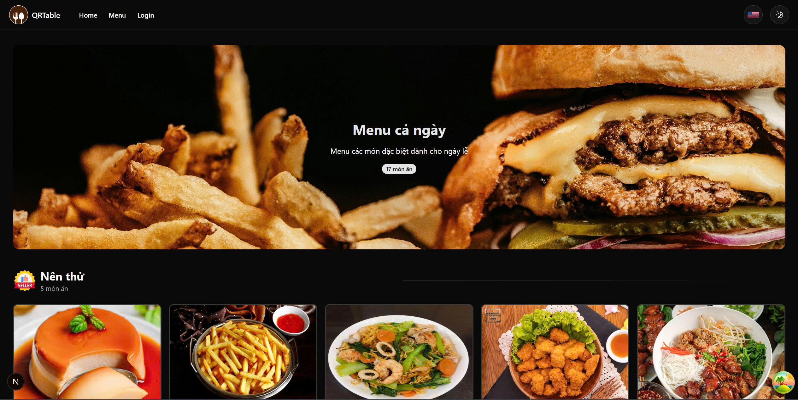
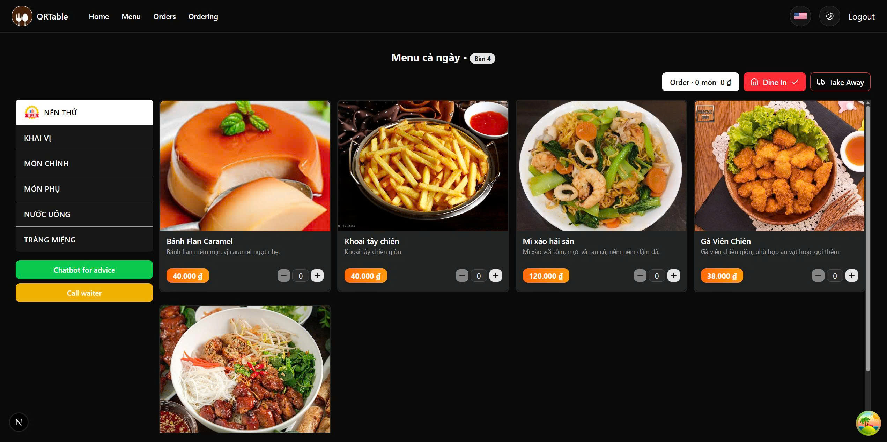
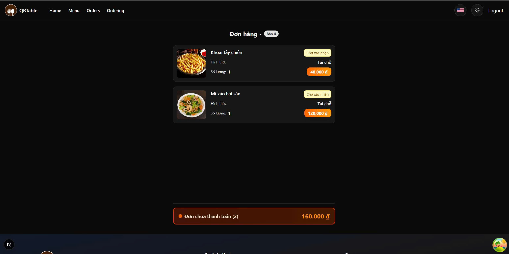
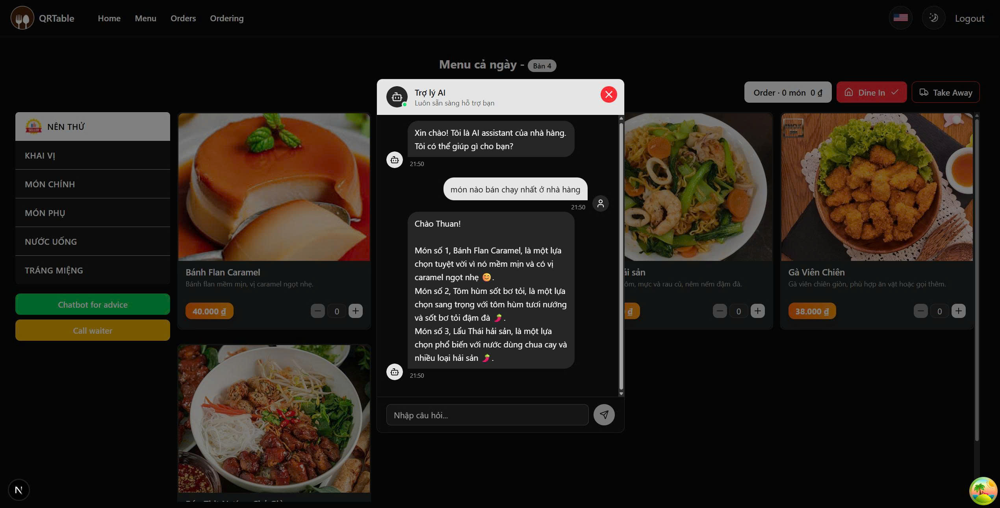
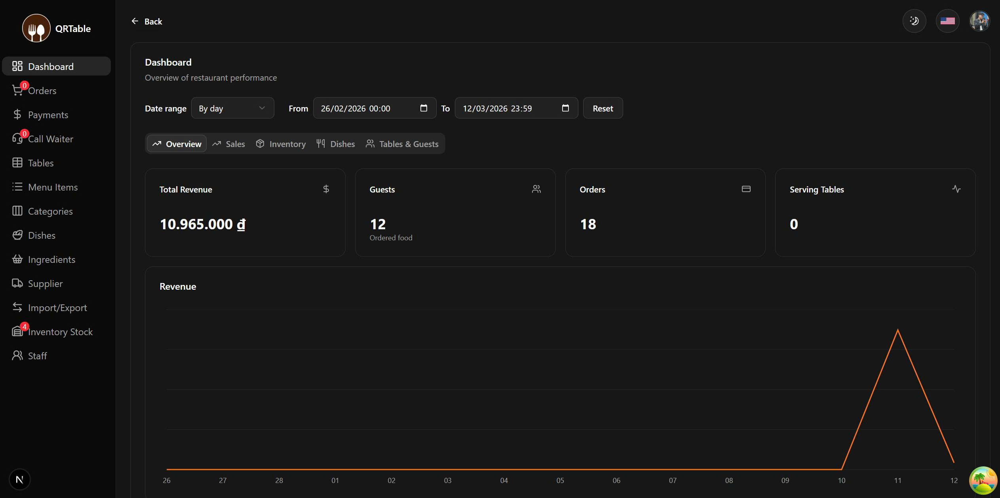
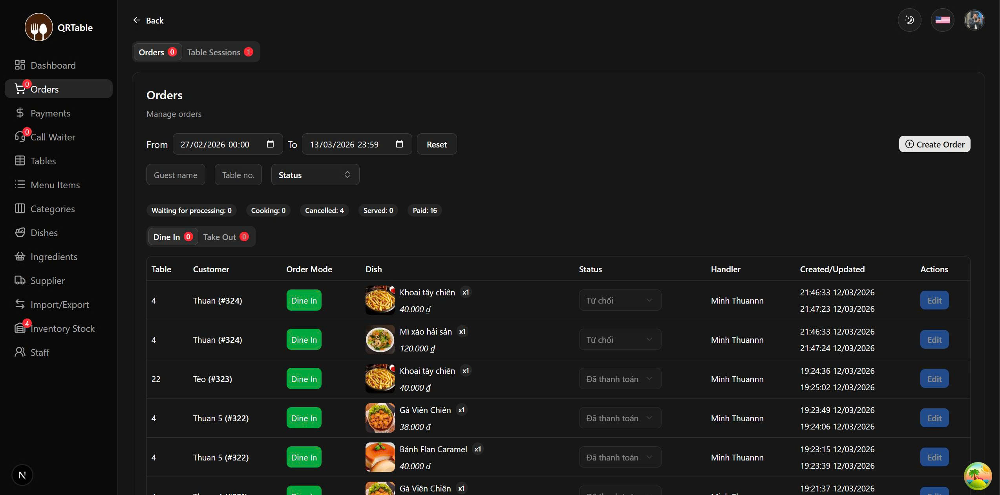
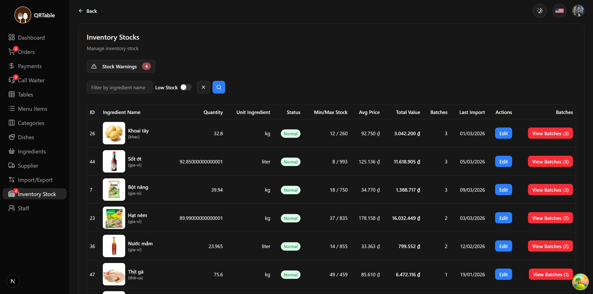
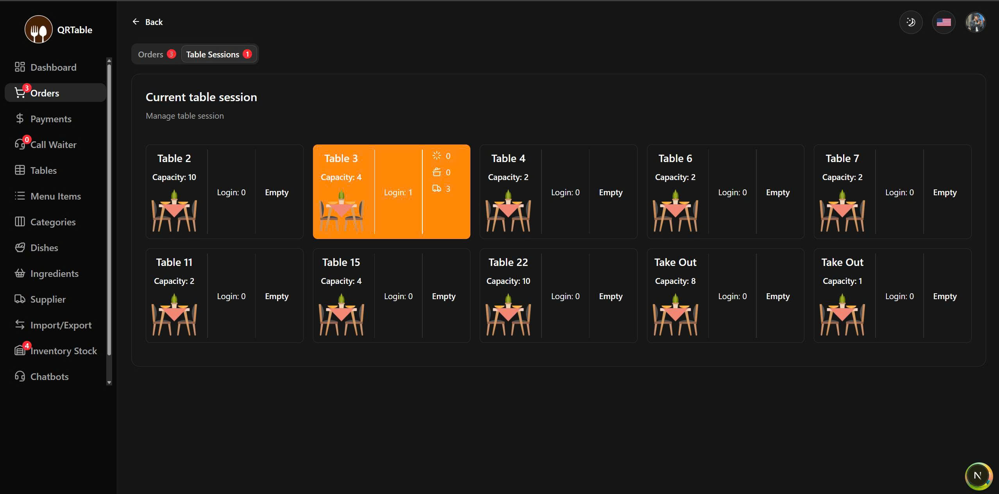
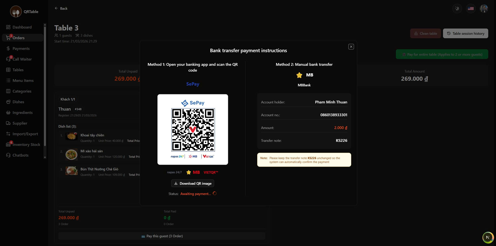

# QRTable - Restaurant Ordering & Management

QRTable là một ứng dụng web cho nhà hàng/quán ăn, được xây dựng với Next.js App Router, hỗ trợ:

- Khách hàng quét QR theo bàn để gọi món.
- Quản lý vận hành (menu, món ăn, bàn, đơn, thanh toán, kho, nhà cung cấp).
- Đăng nhập, phân quyền theo vai trò Owner/Employee/Guest.
- Đa ngôn ngữ vi/en với URL theo locale.

## Mục lục

- Tổng quan
- Tính năng chính
- Hình ảnh website
- Công nghệ sử dụng
- Cấu trúc dự án
- Biến môi trường
- Cài đặt và chạy local
- Build và deploy
- Ghi chú

## Tổng quan

Dự án sử dụng Next.js 16 + React 19 theo kiến trúc App Router. Frontend gọi API backend thông qua lớp `apiRequests/*`, đồng thời có các Route Handler nội bộ để xử lý cookie httpOnly cho login/logout/refresh token.

Hệ thống được tách thành 3 nhóm giao diện chính:

- Public: Trang landing/menu/dish detail/login.
- Guest: Khách sau khi vào bàn (gọi món, xem đơn, lịch sử thanh toán).
- Manage: Khu vực quản trị/nhân viên cho vận hành nhà hàng.

## Tính năng chính

### 1. Authentication + Authorization

- Đăng nhập staff/owner và guest theo 2 flow riêng.
- AccessToken + RefreshToken lưu cookie httpOnly (set ở Next Route Handler).
- Tự động refresh token định kỳ ở client.
- Middleware chặn route theo tình trạng đăng nhập và role.
- Role hiện tại: `Owner`, `Employee`, `Guest`.

### 2. Đặt món bằng QR theo bàn

- Tạo/quản lý QR cho từng bàn.
- Khách truy cập URL theo bàn (`/tables/[number]`), đăng nhập nhanh và đặt món.
- Hỗ trợ order mode: `DINE_IN` (ăn tại quán) và `TAKE_OUT` (mang đi).

### 3. Quản lý vận hành nhà hàng

- Dashboard thống kê tổng quan.
- Quản lý tài khoản nhân sự.
- Quản lý danh mục, món ăn, nguyên liệu, menu.
- Quản lý bàn, phiên bàn (table session), đơn hàng, thanh toán.
- Quản lý kho: tồn kho, nhập kho, xuất kho, lô hàng.
- Quản lý nhà cung cấp và liên kết cung ứng nguyên liệu.
- Xử lý yêu cầu gọi phục vụ từ khách (`guest-call`).

### 4. Real-time + UX

- Socket.IO client cho cập nhật real-time:
  - Đếm số lượt gọi nhân viên.
  - Đếm đơn trong ngày.
  - Cập nhật trạng thái bàn.
  - Đồng bộ trạng thái món theo tồn kho.
- React Query để cache/refetch data.
- UI kết hợp Ant Design + Radix UI + Tailwind CSS.

### 5. Đa ngôn ngữ + SEO

- Đa ngôn ngữ với `next-intl`, locales: `en`, `vi`.
- Routing có locale prefix: `/en/...`, `/vi/...`.
- Metadata động theo từng trang (title, description, canonical).
- Có `robots.ts` và `sitemap.ts` (bao gồm route tĩnh + dish pages động).

## Hình ảnh website

### Giao diện Khách hàng (Public/Guest)

_Ví dụ ảnh minh họa:_






### Giao diện Quản lý (Manage)
_Ví dụ ảnh minh họa:_






## Công nghệ sử dụng

### Core

- Next.js 16 (App Router)
- React 19 + TypeScript
- Tailwind CSS 4

### Data, State, Validation

- @tanstack/react-query
- Zustand
- react-hook-form + zod

### UI và tiện ích

- Ant Design
- Radix UI
- Framer Motion
- Recharts
- Sonner
- Swiper

### Authentication, i18n, Realtime

- jsonwebtoken + jwt-decode
- next-intl
- socket.io-client

## Cấu trúc dự án

```bash
QRTable/
|- messages/                    # Bản dịch i18n (en, vi)
|- public/                      # Static assets
|- src/
|  |- app/
|  |  |- [locale]/              # Route theo ngôn ngữ
|  |  |  |- (public)/           # Public pages
|  |  |  |- guest/              # Guest ordering flow
|  |  |  |- manage/             # Backoffice/management
|  |  |- api/                   # Next Route Handlers
|  |  |- robots.ts
|  |  |- sitemap.ts
|  |- apiRequests/              # API clients tới backend
|  |- components/               # Shared UI/components
|  |- queries/                  # React Query hooks
|  |- schemaValidations/        # Zod schema + types
|  |- i18n/                     # next-intl routing config
|  |- utils/                    # http client, env config
|  |- middleware.ts             # Auth + role + i18n guard
|- package.json
|- next.config.ts
```

## Biến môi trường

Tạo file `.env.local` ở root dự án:

```env
NEXT_PUBLIC_API_ENDPOINT=https://your-backend-api
NEXT_PUBLIC_URL=http://localhost:3000
NEXT_PUBLIC_GOOGLE_AUTHORIZED_REDIRECT_URI=http://localhost:3000/en/login/oauth
NEXT_PUBLIC_GOOGLE_CLIENT_ID=your_google_client_id
```

Lưu ý:

- Các biến môi trường được validate bằng zod trong `src/utils/config.ts`.
- Thiếu biến bắt buộc sẽ throw lỗi `Invalid project configuration` khi khởi động.

## Cài đặt và chạy local

Yêu cầu:

- Node.js 18+ (khuyến nghị 20+)
- npm

1. Cài dependencies

```bash
npm install
```

2. Tạo và cập nhật `.env.local` theo mẫu bên trên.

3. Chạy development server

```bash
npm run dev
```

4. Truy cập:

```text
http://localhost:3000
```

Scripts chính:

```bash
npm run dev    # start dev server
npm run build  # build production
npm run start  # run production server
npm run lint   # lint code
```

## Build và deploy

Build production:

```bash
npm run build
npm run start
```

Gợi ý deploy:

- Vercel (phù hợp nhất với Next.js App Router).
- Có thể deploy trên VPS/Container nếu cần chủ động hạ tầng.

Cần đặt đầy đủ biến môi trường trên hệ thống deploy tương ứng.

## Ghi chú

- Đây là frontend Next.js cho hệ thống QRTable; backend API được cấu hình qua `NEXT_PUBLIC_API_ENDPOINT`.
- Nếu bạn muốn bổ sung tài liệu API backend chi tiết (Swagger/Postman), có thể thêm phần riêng trong README hoặc tài liệu docs.
